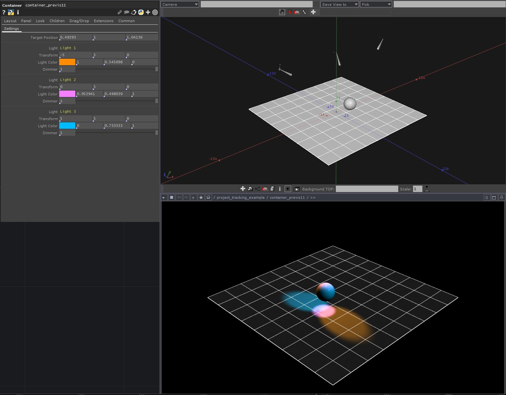

# Previs for Moving Lights in TD

I got an interesting question a few weeks ago about how to use tracking data to control moving lights. If you work with Touch long enough, at some point you'll almost always end up wanting to drive some object in the real world with information derived from calculations in Touch. Where / how can you get started with that process?! It's often temping to straight away jump into just driving the physical object. After all you know what you're trying to do, and you might have a sense of how to get there - so what's the harm?

That's not a bad instinct, but I almost always like to start with some form of previs. You won't always have access to all the equipment you want to use, and more importantly it's often better to make sure you understand the problem you're trying to solve before you start driving motors. The additional bonus here is that solid previs will create some opportunities for testing, and planning that you might not other wise have.

This post is going to look at:

* Planning / mapping out some simple previs for using tracking data on some moving lightsUsing
* the Object CHOP to calculate bearings for rotation information
* Some simple use of custom parameters and bindings
* Pattern matching for renaming
* Using the CHOP export method Channel Name is Path:Parameter
<!-- /wp:list -->

For a walk through you can read about this post here - [TouchDesigner | Previs for Moving Lights](https://matthewragan.com/?p=6144)

